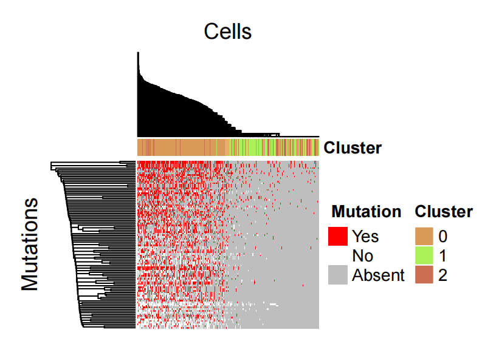
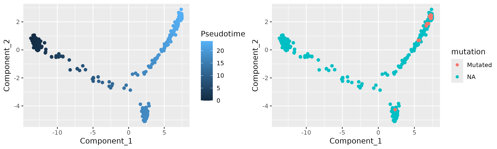

scVar:
===========


Install
===========

[](https://hub.docker.com/repository/docker/zhaoweirepository/scvar/general) 

Dependency data
===========
The dependency data can be downloaded from these links and should be placed in the <reference_path> folder.
- **Vep**:
- **Annovar**:


Usage
===========
## Preparatory work
Please prepare the input files in advance. Follow the instructions below based on your data type.

### 1. Raw Data (FASTQ Files)
If you are providing raw sequencing data, ensure the FASTQ files are named according to the following convention and move the files  to the `<data_path>` directory, like : `./Demo/Raw/*.fastq.gz`

[SampleName]S1_L00[LaneNumber][ReadType]_001.fastq.gz  

### 2. Processed Data (BAM, h5ad, or rds Files)

If you are skipping upstream analysis, prepare the following processed files:
- **BAM files**: Ensure the BAM files are named according to the following convention and move the files to the `<data_path>` directory, like : `./Demo/Processed/*.bam`
- **h5ad files**: Ensure the h5ad files are named according to the following convention and move the files to the `<data_path>` directory, like : `./Demo/Processed/*.h5ad`
- **rds files**: Ensure the Seurat files are named according to the following convention and move the files to the `<data_path>` directory, like : `./Demo/Processed/*.rds`

Only one of either the h5ad file or the rds file is needed.


## Run scVar
### 1. Setup Configuration
Create a configuration file `./scVar/config.yaml` in the `<results_path>` directory. This file should contain the following information:

```yaml
# Configuration file for scVar analysis
# Please fill in the required information below
project:
    <ProjectName> # Project name
samples:
    <SampleName>: SamplePath # Sample name and path to the sample data
result_path:
    <results_path> # Path to save the results
SNV_filter_vaf:
    <VAF> # VAF filter for SNV
threads:
    <number> # Number of threads to use
genotype_filter:
    <reads> #Minimum number of reads required per barcode
genotype_mapq:
    <mapq> # Minimum mapping quality for genotype filtering
genotype_baseq:
    <baseq> # Minimum base quality for genotype filtering
```
### 2. Copy Snakefile
Copy a snakefile file in the `<results_path>` directory.
- **For Raw Data**: Copy `./scVar/Snakefile_Raw` and rename it to Snakefile.
- **For Processed Data**: Copy `./scVar/Snakefile` and rename it to Snakefile.

### 3. Run scVar
```shell
docker run -it -v <reference_path>:/reference -v <results_path>:/results  -v <data_path>:/data scvar /bin/bash -c 'source /opt/miniconda/bin/activate scVar && cd <results_path> && snakemake --cores <cores_number>'
```

- `<reference_path>`: Path to the reference genome directory.
- `<results_path>`: Path to the results directory.
- `<data_path>`: Path to the data directory.
- `<cores_number>`: Number of cores to use for the analysis.

## Upstream Analysis
### 1. Mutation signature, TMB, Entropy
```shell
docker run -it -v <reference_path>:/reference -v <results_path>:/results  -v <data_path>:/data scvar /bin/bash -c 'source /opt/miniconda/bin/activate scVar && bash /codes/Analysis_SigTMBEntroy.sh <project_path> <sample_name>'
```
- `<project_path>`: Path to the project directory.
- `<sample_name>`: Name of the sample to analyze.

### 2. Celltype Specific Mutations
```shell
docker run -it -v <reference_path>:/reference -v <results_path>:/results  -v <data_path>:/data scvar /bin/bash -c 'source /opt/miniconda/bin/activate scVar && bash /codes/Calculate_Specific_Mutations.sh <project_path> <sample_name>'
```
- `<project_path>`: Path to the project directory.
- `<sample_name>`: Name of the sample to analyze.

### 3. Mutation Clustering
```shell
docker run -it -v <reference_path>:/reference -v <results_path>:/results  -v <data_path>:/data scvar /bin/bash -c 'source /opt/miniconda/bin/activate scVar && bash /codes/MutationCluster.sh --path <project_path> --sample <sample_name> --method <method> --flag <flag> --number <number> --clustermethod <clustermethod>'
```
- `<project_path>`: Path to the project directory.
- `<sample_name>`: Name of the sample to analyze.
- `--method`: Method for selecting features (options: `var1`, `var2`, `TF_IDF`, default: `var1`).  
- `--flag`: Flag for clustering (options: `0`, `1`, default: `0`).  
- `--number`: Number of features for clustering (integer, default: `100`).  
- `--clustermethod`: Method for clustering (options: `ward.D`, `ward.D2`, `single`, `complete`, `average`, `mcquitty`, `median`, `centroid`, default: `average`).  

### 4. GO and Oncogenic Pathway
```shell
docker run -it -v <reference_path>:/reference -v <results_path>:/results  -v <data_path>:/data scvar /bin/bash -c 'source /opt/miniconda/bin/activate scVar && bash /codes/GOonco.sh --path <project_path> --sample <sample_name> --pCutoff <pCutoff> --qCutoff <qCutoff>'
```
- `<project_path>`: Path to the project directory.
- `<sample_name>`: Name of the sample to analyze.
- `--pCutoff`: P-value cutoff for GO analysis (default: `0.05`).
- `--qCutoff`: Q-value cutoff for GO analysis (default: `0.2`).

### 5. Psedutime Analysis
```shell
docker run -it -v <reference_path>:/reference -v <results_path>:/results  -v <data_path>:/data scvar /bin/bash -c 'source /opt/miniconda/bin/activate scVar && bash /codes/Pseudotime.sh --path <project_path> --sample <sample_name> --mutation <mutations>'
```
- `<project_path>`: Path to the project directory.
- `<sample_name>`: Name of the sample to analyze.
- `--mutation`: Mutation IDs connected by commas, e.g.,12_25245350_C_G,17_47592542_A_G.

### 6. Statistic
```shell
docker run -it -v <reference_path>:/reference -v <results_path>:/results  -v <data_path>:/data scvar /bin/bash -c 'source /opt/miniconda/bin/activate scVar && bash /codes/Statistic.sh --path <project_path> --sample <sample_name>'
```
- `<project_path>`: Path to the project directory.
- `<sample_name>`: Name of the sample to analyze.

For detailed information on inputs, outputs, scripts, and parameters of each module, refer to [Guided](https://github.com/WeiZhaoLuck/scVar/blob/main/For_developer.md).

## Example Demo
### Preparatory work
- **Copy Input Files**: Copy files from either `./Demo/Raw/` or `./Demo/Processed/` to the <data_path> directory. Add that if copying files from `./Demo/Processed/`, only one of either the h5ad or rds files needs to be copied.
- **Copy Configuration File**: If you copy data from `./Demo/Raw/`, copy `./Demo/Raw_config/config.yaml` and `./Demo/Raw_config/Snakefile` to the `<results_path>` directory. If you copy data from `./Demo/Processed/`, copy `./Demo/Processed_config/config.yaml` and `./Demo/Processed_config/Snakefile` to the `<results_path>` directory.


### Run scVar
    
```shell
docker run -it -v <reference_path>:/reference -v <results_path>:/results  -v <data_path>:/data scvar /bin/bash -c 'source /opt/miniconda/bin/activate scVar && cd /results && snakemake --cores 1'
```
#### Output:
A h5mu file containing transcriptome and mutation information in the <results_path> folder.

### Upstream Analysis
#### 1. Mutation signature,TMB,Entropy and Simpson's Index

```shell
docker run -it -v <reference_path>:/reference -v <results_path>:/results  -v <data_path>:/data scvar /bin/bash -c 'source /opt/miniconda/bin/activate scVar && bash /codes/Analysis_SigTMBEntroy.sh /results/Example Demo'
```
#### Output:
- **Cosimc Files**:  The mutation spectrum results of all cells and different cell types, output similar to:

|  Signature   | Similarity  |
|  ----  | ----  |
| SBS5  | 0.113767901681777 |
| SBS26  | 0.535572494677588 |
| SBS37  | 0.0913866557165417 |
| SBS93  | 0.081081407813563 |
| unknown  | 0.178191540110529 |

- **TMB File**: The TMB results of all cells and different cell types, output similar to:

```txt
Total length of Endothelium qualifying regions: 672240
Mutations count of Endothelium: 16
TMB of Endothelium qualifying regions: 23.80102344400809234797
Total length of Alveolar_cell qualifying regions: 2910688
Mutations count of Alveolar_cell: 40
TMB of Alveolar_cell qualifying regions: 13.74245539198979760111
Total length of All qualifying regions: 3051450
Mutations count of All: 41
TMB of All qualifying regions: 13.43623523243048386832
```

- **Entropy and Simpson's Index File**: The results of the  entropy and Simpson's index for each mutation, output similar to:

|  mutation_id   | entropy  | simpson|
|  ----  | ----  | ----  |
| 10_100208621_T_C  | 0.345117314944953 | 0.8773135906927552 |
| 10_100208724_T_C  | 0.6136190195993708 | 0.7348484848484849 |


#### 2. Celltype Specific Mutations

```shell
docker run -it -v <reference_path>:/reference -v <results_path>:/results  -v <data_path>:/data scvar /bin/bash -c 'source /opt/miniconda/bin/activate scVar && bash /codes/Calculate_Specific_Mutations.sh /results/Example Demo'
```

#### Output: 

The cluster-specific and cell type-specific mutations, output similar to:

|  SNV_label   | p-adjusted  | pvalue| odd_ratio| ref_label1| ref_label2|alt_label1| alt_label2|
|  ----  | ----  | ----  |----  |----  |----  |----  |----  |
| 3_65841633_C_T  | 0.008425429478061056 | 1.7268763021236024e-06 |0 |30 |3 |0 |8 |
| 6_154407634_G_A  | 0.03473458736616632 | 5.695361732513436e-05 |0.01 |30 |2 |1 |6 |


#### 3. Mutation Clustering

```shell
docker run -it <reference_path>:/reference -v <results_path>:/results  -v <data_path>:/data scvar /bin/bash -c 'source /opt/miniconda/bin/activate scVar && bash /codes/MutationCluster.sh --path /results/Example --sample Demo --method TF_IDF --flag 0 --number 80 --clustermethod average'
```

#### Output:
The results of cell clustering based on mutations, similar to:


#### 4. GO and Oncogenic Pathway

```shell
docker run -it <reference_path>:/reference -v <results_path>:/results  -v <data_path>:/data scvar /bin/bash -c 'source /opt/miniconda/bin/activate scVar && bash /codes/GOonco.sh --path /results/Example --sample Demo  --pCutoff 0.05 --qCutoff 0.2'
```
#### Output:
GO and oncogenic pathway enrichment results for all cells and different cell types, output similar to:

|  ONTOLOGY   | ID  | Description| GeneRatio| BgRatio| pvalue|p.adjust| qvalue| geneID| Count| GeneRatio_Value| Sample|
|  ----  | ----  | ----  |----  |----  |----  |----  |----  |----  |----  |----  |----  |
| BP  | GO:0051236 | establishment of RNA localization |15/446 |161/18870 |6.72123269110434e-06 |0.0267773910413597 |0.0248190360846253 |472/9688/55308/3837/87178/8480/8563/7884/9908/51808/4869/9972/348995/8658/7013 |15 |0.0336322869955157 |Alveolar_cell |
| BP  | GO:0006403 | RNA localization |16/446 |197/18870 |1.90948363386813e-05 |0.0380369139866531 |0.0352550978295232 |472/9688/55308/3837/87178/10574/8480/8563/7884/9908/51808/4869/9972/348995/8658/7013 |16 |0.0358744394618834 |Alveolar_cell |


#### 5. Psedutime Analysis

```shell
docker run -it <reference_path>:/reference -v <results_path>:/results  -v <data_path>:/data scvar /bin/bash -c 'source /opt/miniconda/bin/activate scVar && bash /codes/Pseudotime.sh --path /results/Example --sample Demo --mutation 7_6004027_A_G,12_25245350_C_G,17_47592542_A_G,22_20708085_C_T,2_28942361_C_A,3_49684128_A_C,3_49684173_G_A,3_49684565_A_G,7_56116040_A_C,9_137717161_G_T,9_137717162_C_A,X_100662268_C_G'
```
#### Output:

Pseudotime analysis results with highlighted mutated cells, similar to:


#### 6. Statistic

```shell
docker run -it <reference_path>:/reference -v <results_path>:/results  -v <data_path>:/data scvar /bin/bash -c 'source /opt/miniconda/bin/activate scVar && bash /codes/Statistic.sh /results/Example Demo'
```

#### Output:
A report file will be generated. 

## Citation:
